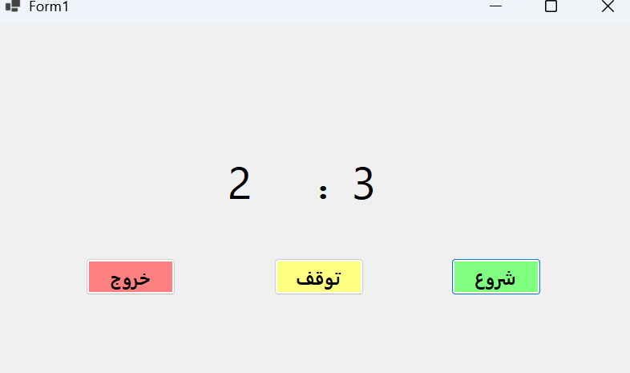

## 📸 Screenshot

# CSharp-Stopwatch
# C# Stopwatch

## 🇮🇷 فارسی

یک برنامه زمان‌سنج ساده با رابط کاربری Windows Forms که با زبان C# توسعه داده شده است.

این برنامه زمان را بر اساس دقیقه و ثانیه نمایش می‌دهد و کاربر می‌تواند زمان‌سنج را شروع یا متوقف کند.

این پروژه به عنوان یک پروژه آموزشی برای تمرین برنامه‌نویسی C# و کار با Timer در Windows Forms ساخته شده است.

### امکانات

- نمایش دقیقه و ثانیه
- شروع زمان‌سنج
- توقف زمان‌سنج
- خروج از برنامه

### تکنولوژی‌ها

- C#
- .NET 8
- Windows Forms
- System.Windows.Forms.Timer

---

## 🇬🇧 English

A simple stopwatch application with a Windows Forms user interface, developed using C#.

The application displays elapsed time in minutes and seconds and allows the user to start and stop the stopwatch.

This project was created as an educational project to practice C# programming and working with timers in Windows Forms.

### Features

- Display minutes and seconds
- Start the stopwatch
- Stop the stopwatch
- Exit the application

### Technologies

- C#
- .NET 8
- Windows Forms
- System.Windows.Forms.Timer
